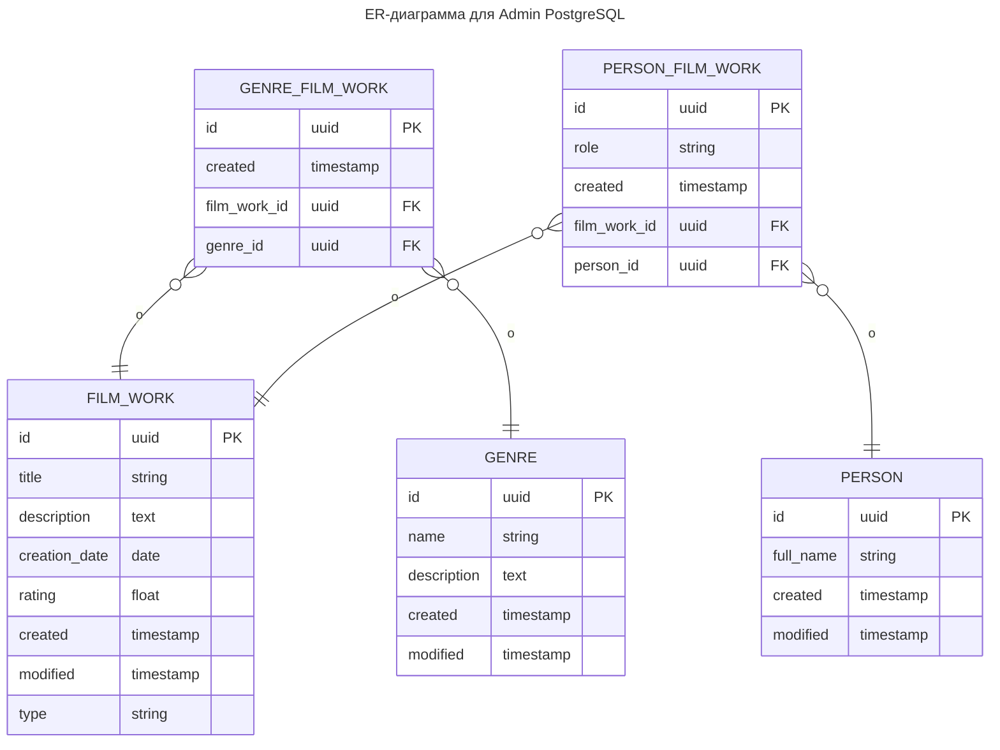

```mermaid
---
title: ER-диаграмма для Admin PostgreSQL
---
erDiagram

FILM_WORK {
    id uuid PK
    title string
    description text
    creation_date date
    rating float
    created timestamp
    modified timestamp
    type string
}

GENRE {
    id uuid PK
    name string
    description text
    created timestamp
    modified timestamp
}

PERSON {
    id uuid PK
    full_name string    
    created timestamp
    modified timestamp
}

GENRE_FILM_WORK {
    id uuid PK
    created timestamp
    film_work_id uuid FK
    genre_id uuid FK
}

PERSON_FILM_WORK {
    id uuid PK
    role string
    created timestamp
    film_work_id uuid FK
    person_id uuid FK
}

GENRE_FILM_WORK }o--|| FILM_WORK: o
GENRE_FILM_WORK }o--|| GENRE: o

PERSON_FILM_WORK }o--|| FILM_WORK: o
PERSON_FILM_WORK }o--|| PERSON: o
```
