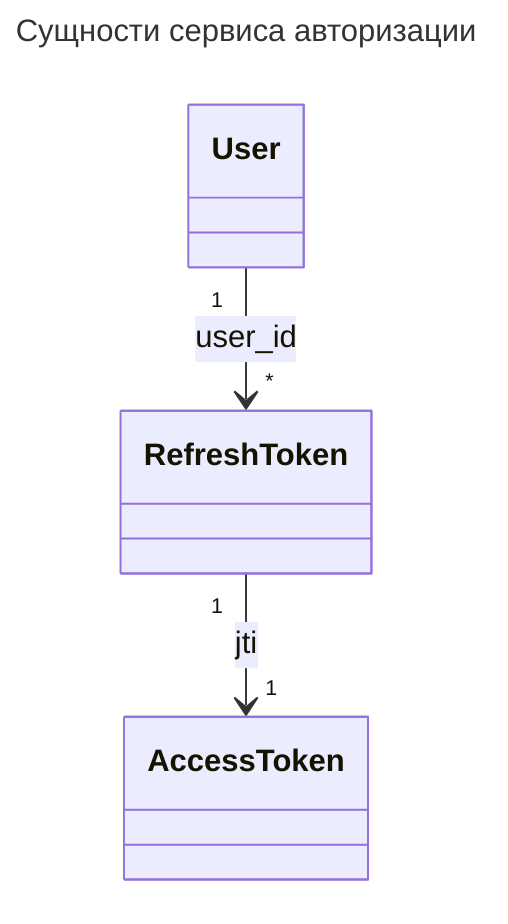

Сервис Auth API предназначен для аутентификации пользователей. Сервис управляет списком пользователей. Пользователь может быть простым или администратором. Посредством API можно создать только простого пользователя. Создать администратора можно из командной строки командой
`make authadmin` или внутри контейнера auth командой
`flask create-superuser --email <email> --password <пароль>`

Сервис Auth API реализует механизм управления ролями пользователей. Пользователь может иметь до нескольких ролей. Auth API выполняет только аутентификацию и предоставляет механизм управления ролями. Авторизацию (ограничение доступа к контенту в соответствии с ролями) реализует прикладной сервис - Async API, Frontend... Возможные роли - `subscriber`, `trial`, `adult`…

Управлять ролями может только администратор. Пароль администратора выдается только доверенному сервису. Это позволяет ограничить риски несанкционированного использования сервиса при условии свободного доступа к API.

Access токен реализован в формате [JWT](https://datatracker.ietf.org/doc/html/rfc7519).
Передается access-токен в поле Bearer заголовка запроса:
```Authorization: Bearer <token>```
Поля payload токена:
- [sub](https://datatracker.ietf.org/doc/html/rfc7519#section-4.1.2) - user_id, идентификатор пользователя в формате UUID . Соответствует полю `USERS.id`.
- email - email пользователя. Соответствует полю `USERS.email`.
- roles - список названий ролей пользователя в формате строки. Соответствует полю `ROLES.name`.
- [exp](https://datatracker.ietf.org/doc/html/rfc7519#section-4.1.4) - дата истечения срока действия access-токена в формате UNIT timestamp
- [jti](https://datatracker.ietf.org/doc/html/rfc7519#section-4.1.7) - идентификатор access-токена. Используется для реализации связи между access и refresh-токенами.
```json
{
    "user_id": "<идентификатор пользователя>",
    "email": "<email пользователя>",
    "roles": ["<роль 1>", "<роль 2>", ...],
    "exp": "<время окончания действия access-токена>",
    "jti": "<идентификатор access-токена>",
    "user-agent": "<браузер клиента>",
    "user-ip": "<IP адрес клиента>"
}
```

Пример заполнения payload в access-токене:
```json
{
    "user_id": "7d05e51b-96a3-4633-a57d-b78964947397",
    "email": "user@example.com",
    "roles": ["subscriber", "adult"],
    "exp": 1516239022,
    "jti": "0bb71cc9-325d-49b7-a154-f5e3b0d5c4b9",
    "user-agent": "Mozilla/5.0 (Macintosh; Intel Mac OS X 10.15; rv:109.0) Gecko/20100101 Firefox/111.0",
    "user-ip": "127.0.0.1"
}
```

Пользователь может осуществлять вход с нескольких устройств одновременно. Для каждого устройства
создается отдельный refresh-токен. Пользователь может выйти на одном устройстве или со всех устройств. При запросе на выход с одного устройства удаляется один соответствующий refresh-токен. При запросе на выход со всех устройств удаляются все refresh-токены, связанные с пользователем.

При обновлении access-токена генерируется новый refresh-токен.

При обновлении refresh-токена в payload access-токена обновляется информация о пользователе (список ролей) актуальными данными из Postgres. За время жизни access-токена может измениться список ролей пользователя.

К одному пользователю может относиться несколько refresh-токенов. К одному refresh-токену может относиться ровно один access-токен.


Refresh-токен реализован в виде UUID и хранится в Redis. Ключ хранения содержит ID пользователя и ID access-токена. Формат записи refresh-токена в Redis:
```
<user_id>:<jti> <refresh-token>
```

Запись нового токена:
```
SET 7d05e51b-96a3-4633-a57d-b78964947397:0bb71cc9-325d-49b7-a154-f5e3b0d5c4b9 "66866d77-008e-433e-9117-01636d953b7c" EX 86400
```

Удаление одного refresh-токена:
```
DEL 7d05e51b-96a3-4633-a57d-b78964947397:0bb71cc9-325d-49b7-a154-f5e3b0d5c4b9
```

Поиск всех refresh-токенов пользователя при запросе на выход со всех устройств:
```
SCAN 0 MATCH 7d05e51b-96a3-4633-a57d-b78964947397:*
```

Доступ к PostgreSQL осуществляется с помощью библиотеки [Flask SQLAlchemy](https://flask-sqlalchemy.palletsprojects.com/en/3.0.x/). Для управления структурой базы используется [Flask-Migrate](https://flask-migrate.readthedocs.io/en/latest/).

Основные команды Flask-Migrate:
`flask db init` - начальная инициализация пакета, выполняется один раз.
После изменения моделей необходимо создать файл с описанием миграции командой `flask db migrate`.
Файл создается в папке `auth/migrations/versions`. Его надо просмотреть и поправить вручную. Выполнение миграции в базе данных запускается командой `flask db upgrade`.

[ER-диаграмма PostgreSQL](auth-er-diagram.md)

[Описание API в формате OpenAPI](auth-openapi.yaml)

# Последовательность запросов при различных действиях

[Регистрация нового пользователя](sd-signup.md)

[Вход пользователя](sd-login.md)

[Обновление токенов](sd-refresh.md)

[Проверка пользователя](sd-check.md)

[Удаление пользователя](sd-delete.md)
