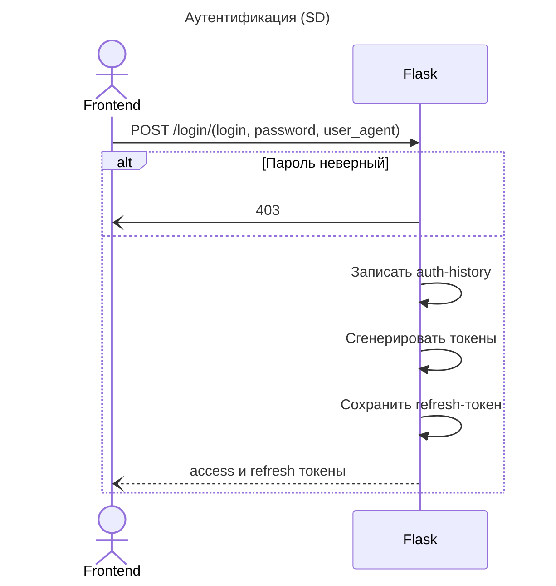

```mermaid
---
title: Аутентификация (SD)
---

sequenceDiagram
    actor Frontend
    participant Flask

    Frontend ->> Flask: POST /login/(login, password, user_agent)

    alt Пароль неверный
        Flask -) Frontend: 403
    else
        Flask ->> Flask: Записать auth-history
        Flask ->> Flask: Сгенерировать токены
        Flask ->> Flask: Сохранить refresh-токен
        Flask --) Frontend: access и refresh токены
    end
```
