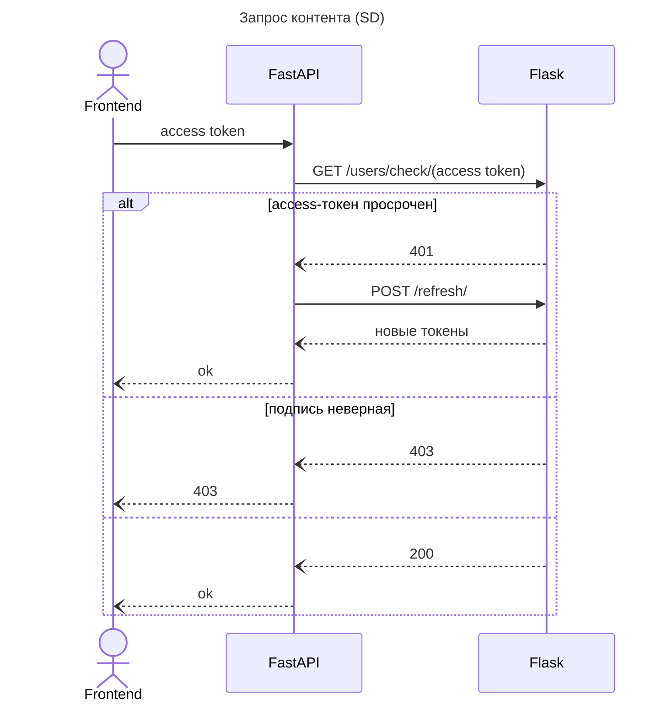

При получении запроса прикладной сервис проверяет приложенный 
к запросу access токен, делая запрос к сервису Auth API. Auth API
проверяет подпись токена не совершая запрос к базе данных, что
снижает нагрузку на систему.

