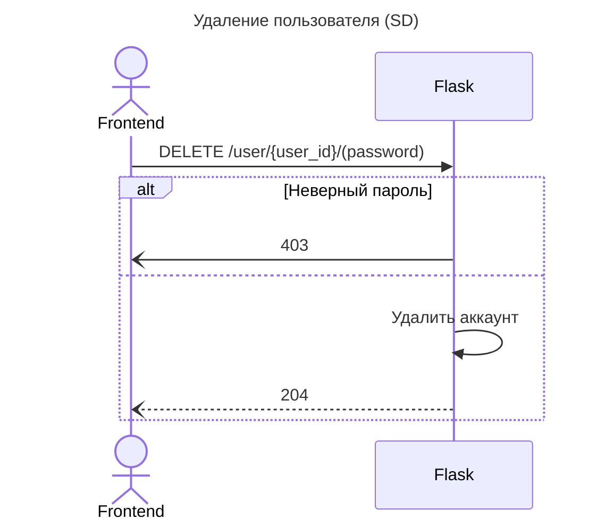

```mermaid
---
title: Удаление пользователя (SD)
---

sequenceDiagram
    actor Frontend
    participant Flask

    Frontend ->> Flask: DELETE /user/{user_id}/(password)

    alt Неверный пароль
        Flask -) Frontend: 403
    else
        Flask ->> Flask: Удалить аккаунт
        Flask --) Frontend: 204
    end
```

При запросе удаления аккаунта frontend запрашивает у пользователя текущий пароль и передает его в теле запроса.
