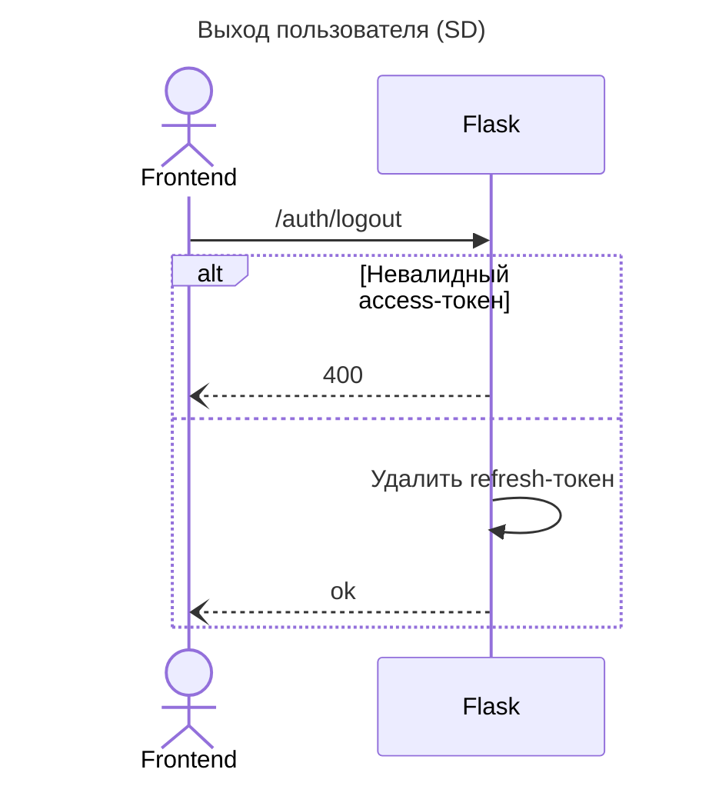

```mermaid
---
title: Выход пользователя (SD)
---

sequenceDiagram
    actor Frontend
    participant Flask

    Frontend ->> Flask: /auth/logout

    alt Невалидный access-токен
        Flask --) Frontend: 400
    else
        Flask ->> Flask: Удалить refresh-токен
        Flask --) Frontend: ok
    end
```
