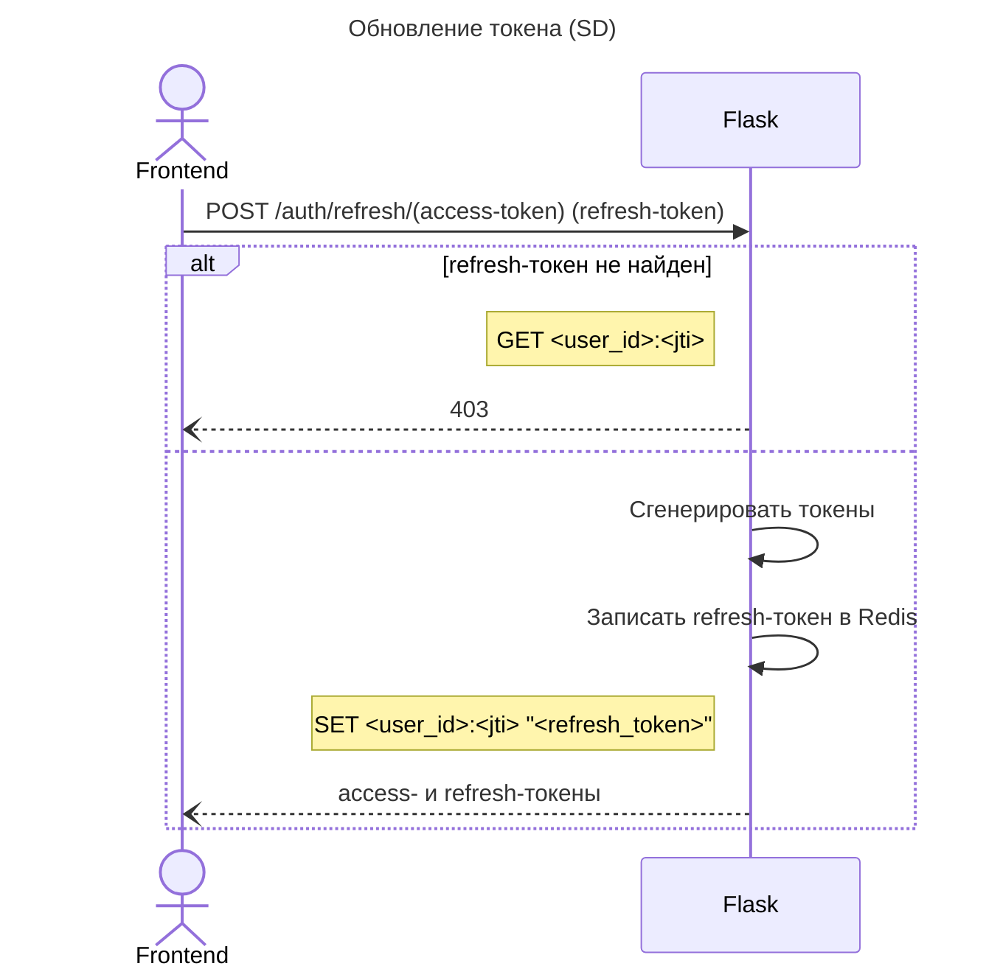

```mermaid
---
title: Обновление токена (SD)
---

sequenceDiagram
    actor Frontend
    participant Flask

    Frontend ->> Flask: POST /auth/refresh/(access-token) (refresh-token)

    alt refresh-токен не найден
        Note left of Flask: GET <user_id>:<jti>
        Flask --) Frontend: 403
    else
        Flask ->> Flask: Сгенерировать токены
        Flask ->> Flask: Записать refresh-токен в Redis
        Note left of Flask: SET <user_id>:<jti> "<refresh_token>"
        Flask --) Frontend: access- и refresh-токены
    end
```
