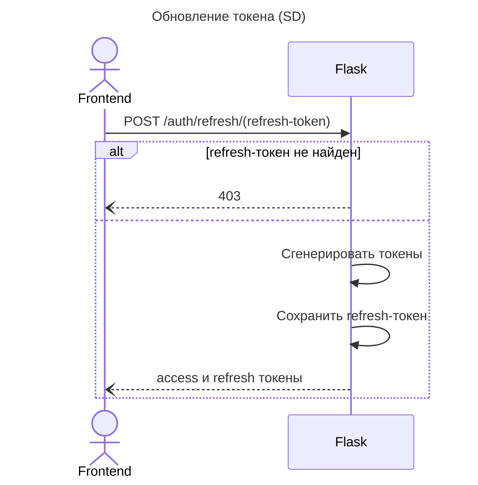

```mermaid
---
title: Обновление токена (SD)
---

sequenceDiagram
    actor Frontend
    participant Flask

    Frontend ->> Flask: POST /auth/refresh/(refresh-token)

    alt refresh-токен не найден
        Flask --) Frontend: 403
    else
        Flask ->> Flask: Сгенерировать токены
        Flask ->> Flask: Сохранить refresh-токен
        Flask --) Frontend: access и refresh токены
    end
```
