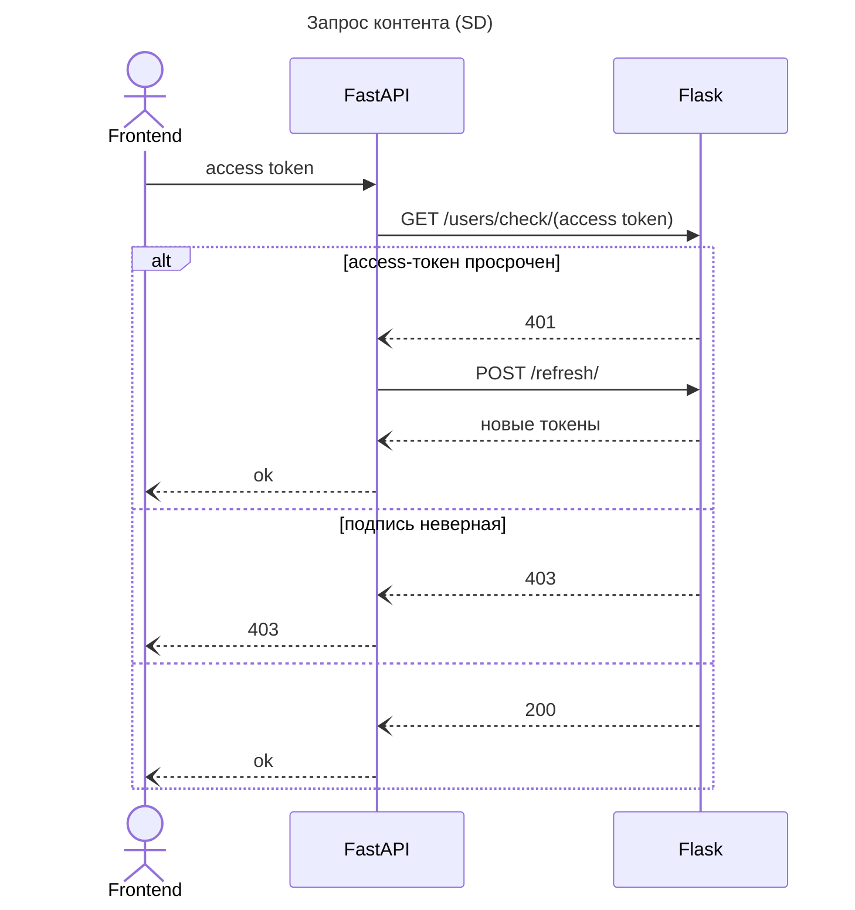

```mermaid
---
title: Запрос контента (SD)
---

sequenceDiagram
    actor Frontend
    participant FastAPI
    participant Flask

    Frontend ->> FastAPI: access token
    FastAPI ->> Flask: GET /users/check/(access token)

    alt access-токен просрочен
        Flask --) FastAPI: 401
        FastAPI ->> Flask: POST /refresh/
        Flask --) FastAPI: новые токены
        FastAPI --) Frontend: ok
    else подпись неверная
        Flask --) FastAPI: 403
        FastAPI --) Frontend: 403
    else
        Flask --) FastAPI: 200
        FastAPI --) Frontend: ok
    end
```
