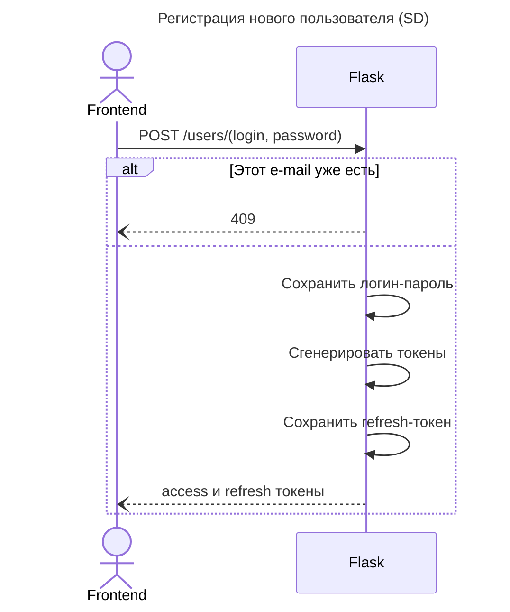

```mermaid
---
title: Регистрация нового пользователя (SD)
---

sequenceDiagram
    actor Frontend
    participant Flask

    Frontend ->> Flask: POST /users/(login, password)

    alt Этот e-mail уже есть
        Flask --) Frontend: 409
    else
        Flask ->> Flask: Сохранить логин-пароль
        Flask ->> Flask: Сгенерировать токены
        Flask ->> Flask: Сохранить refresh-токен
        Flask --) Frontend: access и refresh токены
    end
```
