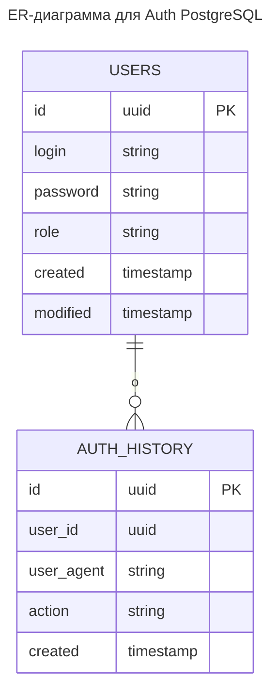

```mermaid
---
title: ER-диаграмма для Auth PostgreSQL
---
erDiagram

USERS {
    id uuid PK
    login string
    password string
    role string
    created timestamp
    modified timestamp
}

AUTH_HISTORY {
    id uuid PK
    user_id uuid
    user_agent string
    action string
    created timestamp
}

USERS ||--o{ AUTH_HISTORY: o
```
