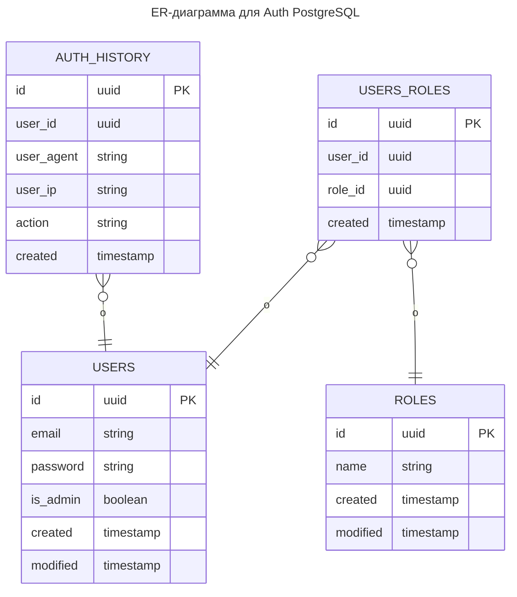

```mermaid
---
title: ER-диаграмма для Auth PostgreSQL
---
erDiagram

USERS {
    id uuid PK
    email string
    password string
    is_admin boolean
    created timestamp
    modified timestamp
}

AUTH_HISTORY {
    id uuid PK
    user_id uuid
    user_agent string
    user_ip string
    action string
    created timestamp
}

ROLES {
    id uuid PK
    name string
    created timestamp
    modified timestamp
}

USERS_ROLES {
    id uuid PK
    user_id uuid
    role_id uuid
    created timestamp
}

AUTH_HISTORY }o--|| USERS: o
USERS_ROLES }o--|| USERS: o
USERS_ROLES }o--|| ROLES: o
```
