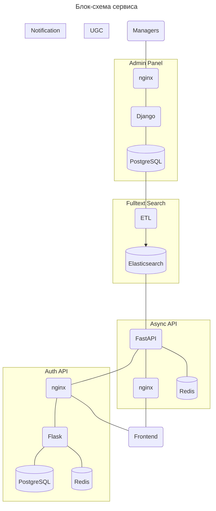

```mermaid
---
title: Блок-схема сервиса
---
graph TD

frontend(Frontend)
managers(Managers)

subgraph admin[Admin Panel]
    nginx_admin(nginx)
    django(Django)
    postgres_admin[(PostgreSQL)]
    
    django --- postgres_admin
    nginx_admin --- django
end

subgraph search[Fulltext Search]
    etl(ETL)
    elasticsearch[(Elasticsearch)]

    etl --> elasticsearch
end

subgraph async[Async API]
    fastapi(FastAPI)
    nginx_async(nginx)
    redis_async[(Redis)]

    fastapi --- nginx_async
    fastapi --- redis_async
end

subgraph auth[Auth API]
    postgres_auth[(PostgreSQL)]
    redis_auth[(Redis)]
    nginx_auth(nginx)
    flask(Flask)

    flask --- postgres_auth
    flask --- redis_auth
    nginx_auth --- flask
end

subgraph ugc[UGC]
end

subgraph notification[Notification]
end

managers --- nginx_admin
postgres_admin --- etl

elasticsearch ---- fastapi

nginx_async --- frontend
nginx_auth --- frontend

fastapi --- nginx_auth
```
